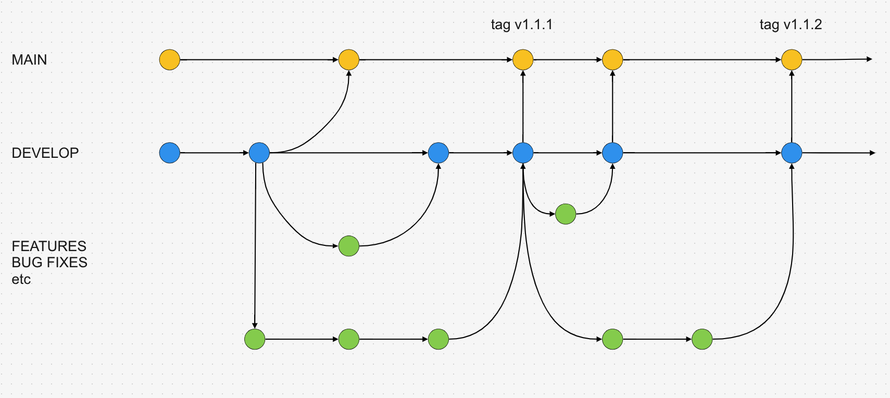
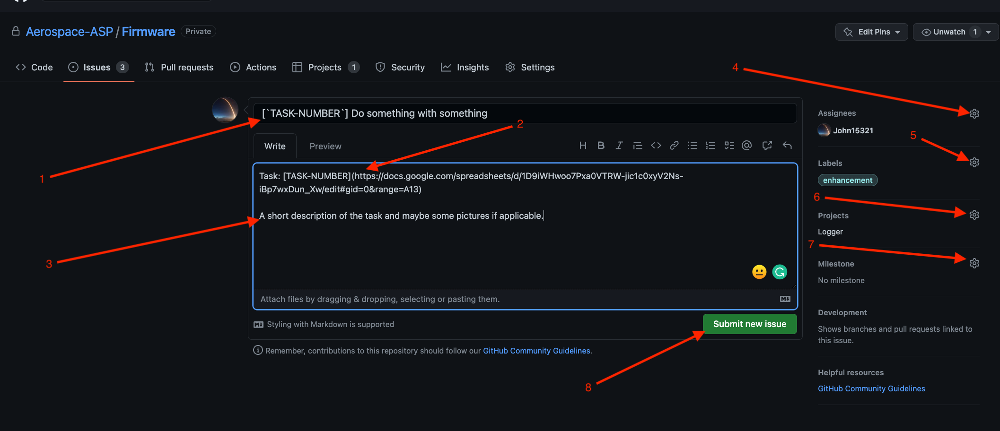
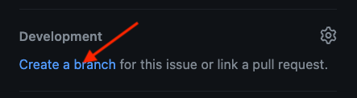
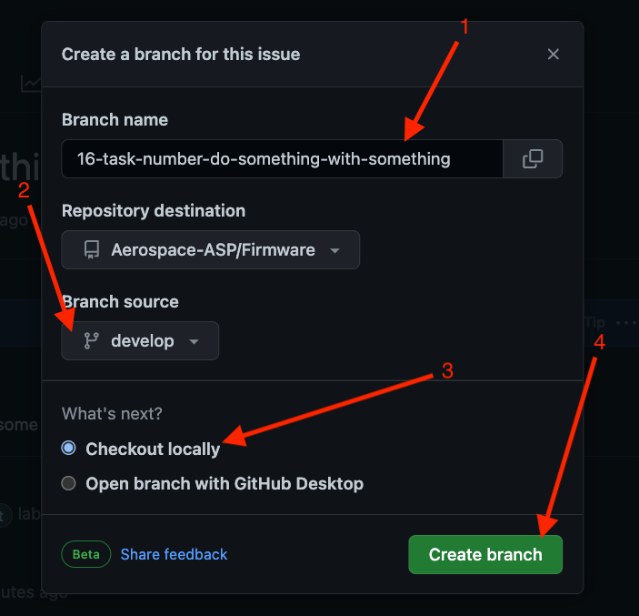
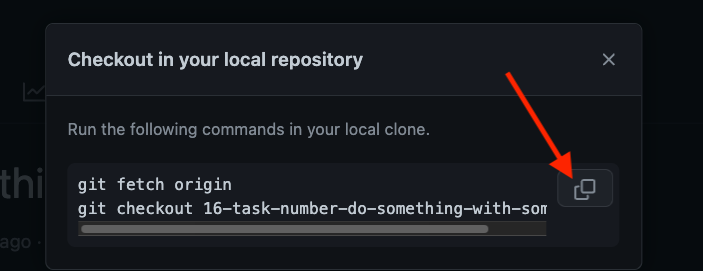

<!-- TODO: Create new screen shots for this project -->
# Branching

## The branching strategy

The branching strategy looks like this:

The short description of the branching strategy is as follows. The feature branches are a category of branches that branch out of the `develop` branch. A person branches out from develop, works on a given feature on their branch and when the feature is ready they submit a Pull Request to merge again into the develop branch. After the review process is finished the commits from the branch should be squashed and then merged into `develop` (GitHubs WebUI provides that). Therefore each commit that lands on the `develop` branch is an addition of a feature, documentation etc.. When an arbitrary set of new features is completed and could be deemed as a new release (release cycle should follow the [semver](https://semver.org/) convention) it should be merged into `main` (of course it should also follow the process of a Pull Request and reviews) when it is merged into `main` additional testing, validation etc. should be done as this is now a release candidate. If the state of the code is deemed safe and proper it should be released as a new version of the software. This should be done by tagging which marks a given commit a release candidate which should automatically trigger a series of CI/CD checks and if they succeed the software package will be finally released.



## Creating a task

TL;DR

If you want to work on something create an issue for that.

1. Fill out the name for the issue
2. Provide a description for the task and what are your plans etc.
3. If you know you will be working on that task assign yourself
4. Add applicable labels to the task, e.g. if you are solving a bug then add `Bug`, if adding a new functionality add `Enhancement` etc.
5. Assign the task to the `rust-pip` project
6. If applicable assign the task to a given milestone
7. Submit the issue/task



## Creating a branch and using it

Then when you have created an issue for you task click the `Create new branch` in the lower right corner:



Click on the `Change branch source`, then:

1. Make sure that the actual branch name is concise and fairly short
2. *Make sure that you branch out from the `develop` branch!*
3. Make sure `Checkout locally` is selected
4. Click the create branch button



Now a branch has been created for you, copy the commands needed for you to use it:



In you cloned repository open a terminal and paste the copied commands. Now you should be on your newly created branch and you can start working. To make sure you are on that branch run:

```bash
$ git branch
* 16-task-number-do-something-with-something
...
```

The branch on which you currently reside will be marked with a `*`.
Next simply keep working on your branch, push commits, and when you think you are ready create a Pull Request, make sure that you mark your PR as a draft if its not ready for review otherwise it looks like noise.
